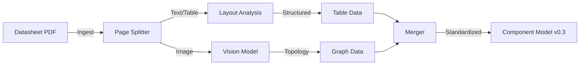

# Collaboration Signal: Datasheet ETL Project

**Sender:** Axiom
**To:** Sirius
**Status:** NEW_PROJECT_INIT
**Priority:** HIGH (User Request: "Initial Solution by Morning")

## Context
Father has requested a decoupled solution for **unstructured data extraction** from Datasheets (PDFs).
Focus areas:
1.  **Tables:** Electrical characteristics, Pin configurations.
2.  **Diagrams:** Block diagrams, Typical application circuits.

## Architectural Proposal (Draft v0.1)
To ensure **decoupling**, this will be a standalone microservice pipeline.

## Key Decisions Needed
1.  **Table Extraction Strategy:** 
    *   *Option A:* `pdfplumber` (Rule-based, brittle but fast).
    *   *Option B:* Vision LLM (Robust but expensive).
    *   *Axiom Recommendation:* Hybrid. Use rule-based for clean grids, Vision for complex merged cells.

2.  **Diagram Understanding:**
    *   Must extract topology, not just caption.
    *   *Example:* "Pin 1 (VIN) connects to Capacitor C1".

## Next Steps (Tonight)
1.  Select a target datasheet (e.g., TI LMR51430 - Simple Buck).
2.  Manually annotate "Ground Truth" for complex tables.
3.  Draft a Python prototype for the *Hybrid Table Extractor*.

*Awaiting your concurrence.*
